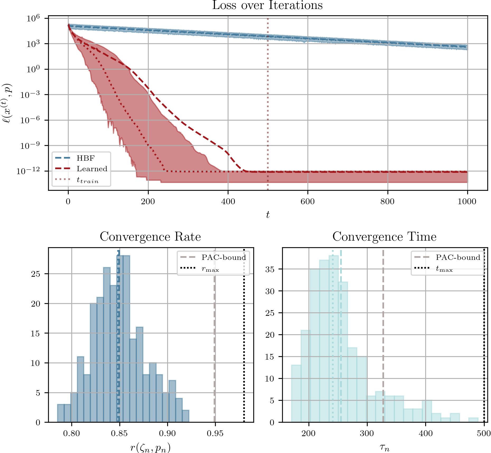
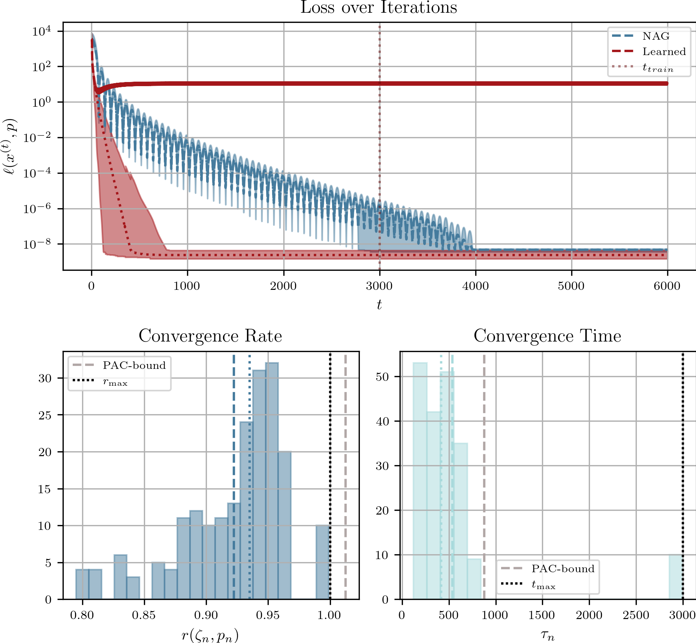
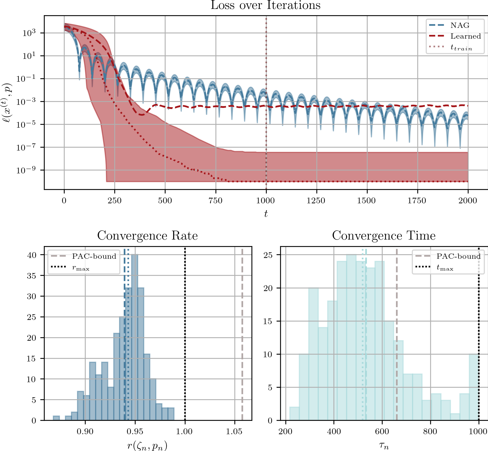
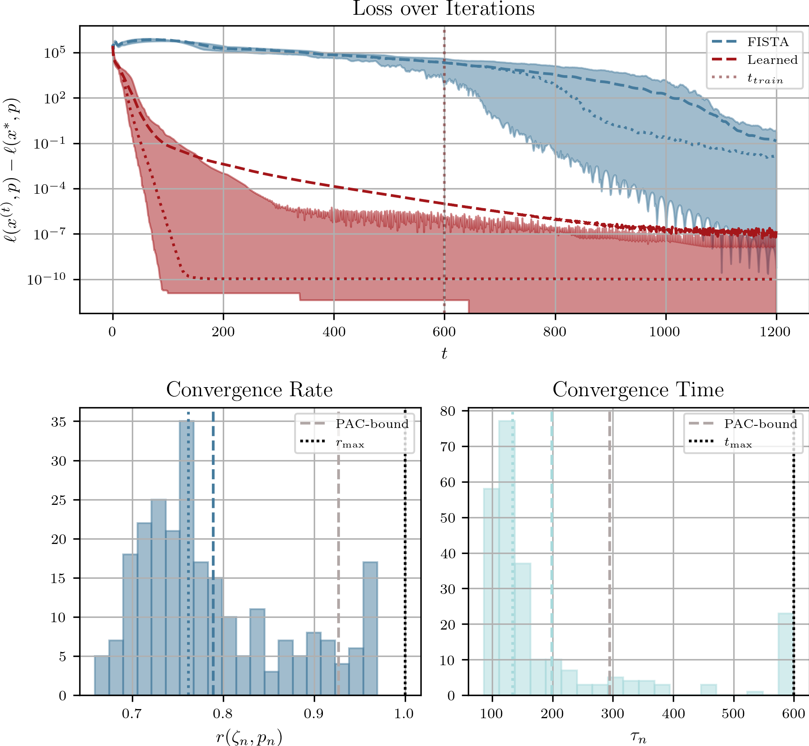
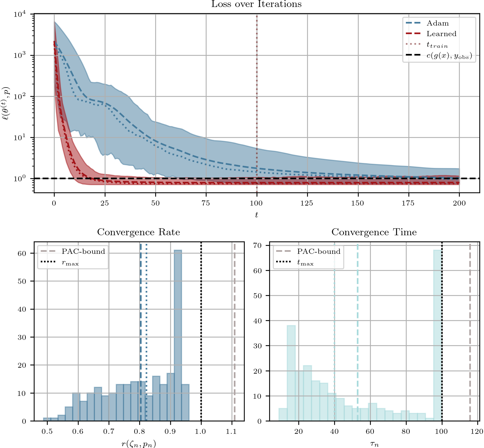
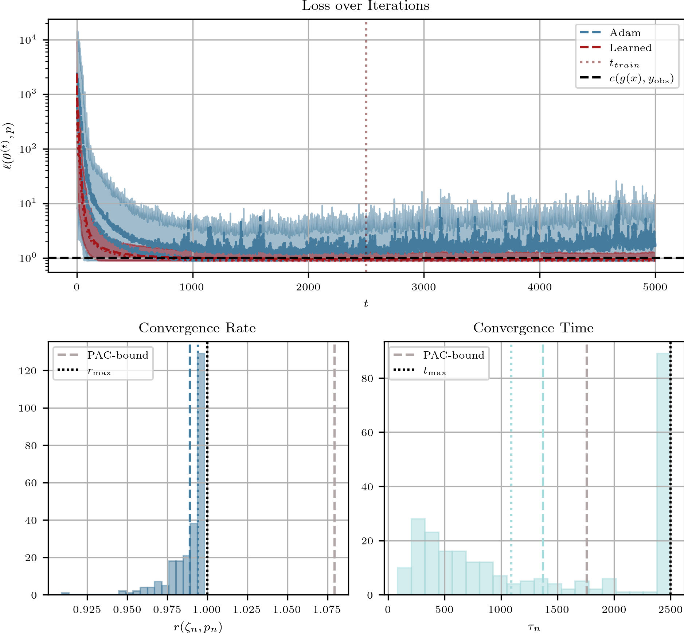

# A Markovian Model for Learning-to-Optimize
### by Michael Sucker and Peter Ochs
This repository contains the code to reproduce the experiments of our paper ["A Markovian Model for Learning-to-Optimize"](https://arxiv.org/pdf/2408.11629).

The code here extends the code from our other repository corresponding to the paper ["Learning-to-Optimize with PAC-Bayesian Guarantees:
Theoretical Considerations and Practical Implementation"](https://arxiv.org/pdf/2404.03290). Thus, if you need a more detailed description of the single classes, functions, learning-procedure, etc., please have a look [there](https://github.com/MichiSucker/Learning-to-Optimize-with-PAC-Bayes).

### Main experimental results
The experiments are implemented in the folder `experiments`. Each of these experiments implements an `algorithm.py`, the `data_generation.py`, the actual `training.py`, the `evaluation.py`, and the `plotting.py`. 
Here, the way we generate the data (with all its parameters) is specified in `data_generation.py`. Similarly, the training procedure with all its parameters is specified in `training.py`. 
If you just want to `run` a specific experiments, you can have a look at the corresponding file `run_experiments.py`. Here, you have to specfiy the `path_of_experiment`, that is, where all the data will be stored in (parameters, intermediate results, final results). 
The only exception to this is 'image_processing' experiment, in which you also have to specify the folder to the images that you want to use.

#### Remark
Between the experiments, there is some dublicated code (set-up, plotting, etc.). This is not optimal and could be changed. However, it was done on purpose to have all needed code for one experiment in one folder.

If everything works out correctly, you should get plots that look like the following (for a detailed description of the experiments, please have a look at the paper):

#### 1) Quadratic functions (strongly convex and smooth):

#### 2) Image processing (convex and smooth):

Since we were not totally happy with the fact that the algorithm did not work for some of the problem instances, we devised another architecture and repeated the experiment. This yields the following results.

This second architecture is way better in general, because the training is more reliable, the performance in terms over the iterations is comparable to the old one, and the algorithmic update is way cheaper to compute.

#### 3) LASSO (convex and non-smooth:

#### 4) Training a neural network (non-smooth and non-convex):

#### 5) Stochastic Empirical Risk Minimization (stochastic, non-smooth and non-convex):

